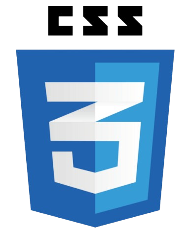

Hi, I'm Anurag👋

🌱 I’m currently learning React.js, Node.js, and Django REST Framework.

🚀 I’m building The Catalyst Project, a mentorship platform for JEE aspirants.

🔧 I'm part of IIT Bombay Racing and a Web Convenor at ITC, IIT Bombay.

💬 Ask me about Web Development, React, Node.js, and Photography.

📫 How to reach me: [anuragdesai2019@gmail.com]

 

<h3 font-weight="800">🌐 Connect with Me </h3>

 

<h3 font-weight="800">💻 Front End </h3>

</img>
</img>
</img>

 

<h3 font-weight="800">🖥️ Back End </h3>

</img>
</img>

 

<h3 font-weight="800">⚡Design </h3>

</img>
</img>
</img>

<h3 font-weight="800">📊 Git hub Stats </h3>

